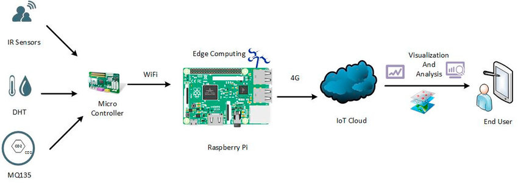
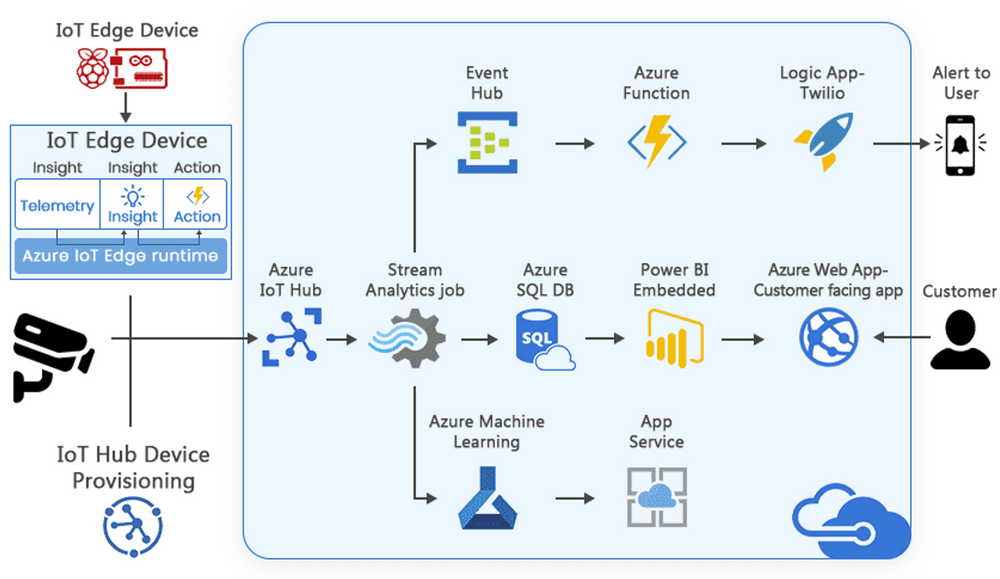

# Edge Computing POC with Raspberry Pi, ESP8266, DHT11, MQTT, and Azure IoT Hub

Edge computing is a distributed computing paradigm that brings computation and data storage closer to the edge of the network, where the data is generated. This can help to improve performance, reduce latency, and protect data privacy.

In this article, we will build an edge computing architecture using Raspberry Pi, ESP8266, DHT11, MQTT, and Azure IoT Hub. The Raspberry Pi will be used as an edge device, which will be connected to an ESP8266 microcontroller. The ESP8266 will collect data from a DHT11 temperature and humidity sensor, and then publish that data to the Raspberry Pi using the MQTT protocol. The Raspberry Pi will consume the data from the ESP8266, and then stream it to Azure IoT Hub.



### Hardware

The following hardware is required for this project:

- A Raspberry Pi
- An ESP8266 microcontroller
- A DHT11 temperature and humidity sensor

### Software

The following software is required for this project:

- The Raspberry Pi OS
- The ESP8266 Arduino IDE
- The MQTT broker
- The Azure IoT Hub

### Setup

The following steps are required to set up the architecture:

1.  Install the Raspberry Pi OS on the Raspberry Pi.
2.  Enable the MQTT broker on the Raspberry Pi.
3.  Install the ESP8266 Arduino IDE on your computer.
4.  Create a new project in the ESP8266 Arduino IDE.
5.  Add the DHT11 library to the project.
6.  Create a sketch that collects data from the sensor and publishes it to the MQTT broker.
7.  Create a new IoT Hub in Azure.
8.  Create a device identity in the IoT Hub.

## Code Explanation

```c++
// dth11.ino

#include "DHT.h"
#include <ESP8266WiFi.h>
#include <PubSubClient.h>
#include <ArduinoJson.h>

#define DHTTYPE DHT11 // DHT 11 SENSOR
#define dht_dpin 0

DHT dht(dht_dpin, DHTTYPE);

WiFiClient espClient;
PubSubClient client(espClient);

// WiFi
const char *ssid = "";     // Enter your WiFi name
const char *password = ""; // Enter WiFi password

// MQTT Broker
const char *mqtt_broker = "";
const char *topic = "edge/temp";
const char *mqtt_user = "";
const char *mqtt_password = "";
const int mqtt_port = 1883;

void setup(void)
{
  dht.begin();
  Serial.begin(9600);
  Serial.println("Humidity and temperature\n\n");

  WiFi.begin(ssid, password);
  while (WiFi.status() != WL_CONNECTED)
  {
    delay(1000);
    Serial.println("Connecting to WiFi...");
  }
  Serial.println("Connected to WiFi");

  client.setServer(mqtt_broker, mqtt_port);
  client.setCallback(callback);

  while (!client.connected())
  {
    Serial.println("Connecting to MQTT...");
    if (client.connect("ESP8266Client", mqtt_user, mqtt_password))
    {
      Serial.println("Connected to MQTT");
    }
    else
    {
      Serial.print("Failed, rc=");
      Serial.print(client.state());
      Serial.println(" Retrying in 5 seconds...");
      delay(5000);
    }
  }
}

void loop()
{
  if (!client.connected())
  {
    reconnect();
  }
  client.loop();

  float h = dht.readHumidity();
  float t = dht.readTemperature();
  Serial.printf("Current humidity = %.2f%%  temperature = %.2fC\n", h, t);

  // Create a JSON object and serialize it to a string
  StaticJsonDocument<100> jsonDocument; // Adjust the size as needed
  jsonDocument["humidity"] = h;
  jsonDocument["temperature"] = t;
  String jsonString;
  serializeJson(jsonDocument, jsonString);

  // Publish humidity and temperature to MQTT
  client.publish(topic, jsonString.c_str());

  delay(800);
}

void callback(char *topic, byte *payload, unsigned int length)
{
  // Handle incoming MQTT messages here if needed
}

void reconnect()
{
  while (!client.connected())
  {
    Serial.println("Connecting to MQTT...");
    if (client.connect("ESP8266Client", mqtt_user, mqtt_password))
    {
      Serial.println("Connected to MQTT");
    }
    else
    {
      Serial.print("Failed, rc=");
      Serial.print(client.state());
      Serial.println(" Retrying in 5 seconds...");
      delay(5000);
    }
  }
}
```

This code snippet is an example of an MQTT temperature and humidity sensor using an ESP8266 microcontroller board. Here's an overview of how it works:

1. Include necessary libraries: The code begins by including the required libraries. It uses the `DHT` library to communicate with the DHT11 sensor, the `ESP8266WiFi` library to connect to WiFi, the `PubSubClient` library to publish messages to an MQTT broker, and the `ArduinoJson` library to work with JSON data.

2. Define constants: The code defines some constants such as the DHT sensor type (`DHTTYPE`), the pin to which the sensor is connected (`dht_dpin`), the WiFi network SSID and password, the MQTT broker address, the MQTT topic to publish to, the MQTT username and password, and the MQTT port.

3. Setup function: The `setup()` function is executed once when the microcontroller starts up. It initializes the DHT sensor, starts serial communication for debugging, connects to the WiFi network, sets up the MQTT client, and establishes a connection to the MQTT broker.

4. Loop function: The `loop()` function is executed repeatedly after the `setup()` function. It checks if the MQTT client is connected, and if not, attempts to reconnect. Then it reads the humidity and temperature values from the DHT sensor, creates a JSON object containing the values, serializes the JSON object into a string, and publishes the message to the MQTT broker.

5. Callback function: The `callback()` function is a placeholder for handling incoming MQTT messages, but it is currently empty.

6. Reconnect function: The `reconnect()` function is used to retry connecting to the MQTT broker if the connection is lost. It is called from the `loop()` function when the MQTT client is not connected.

Overall, this code allows the ESP8266 board to read temperature and humidity data from the DHT11 sensor and publish it to an MQTT broker, which can be subscribed to by other MQTT clients for further processing.

```python
# edge_device.py

import threading
import uuid

import paho.mqtt.client as mqtt
from azure.iot.device import IoTHubDeviceClient

# MQTT Broker (Broker address and port)
MQTT_BROKER = ""
MQTT_PORT = 1883
MQTT_USERNAME = ""
MQTT_PASSWORD = ""

# MQTT Topics to subscribe to (you can add more topics as needed)
TOPICS = ["edge/temp"]


# Azure IoT Hub connection string
IOTHUB_CONNECTION_STRING = "iot_hub_device_connection_string"
client = IoTHubDeviceClient.create_from_connection_string(IOTHUB_CONNECTION_STRING)

# Callback when the client connects to the broker
def on_connect(client, userData, flags, rc):
    if rc == 0:
        print(f"Connected to MQTT broker with result code: {rc}")
        for topic in TOPICS:
            client.subscribe(topic)
    else:
        print(f"Connection failed with result code: {rc}")


# Callback when a message is received from the broker
def on_message(client, userData, msg):
    topic = msg.topic
    payload = msg.payload.decode("utf-8")
    print(f"Received message on topic '{topic}': {payload}")

    # Acknowledge receipt to the sender (publish an acknowledgment message)
    # You can customize the acknowledgment message as per your use case
    # For example, send an ACK with the topic + "/ack" and a specific payload.
    acknowledgment_topic = topic + "/ack"
    acknowledgment_payload = "Received"
    client.publish(acknowledgment_topic, acknowledgment_payload)

    # Send data to Azure IoT Hub
    send_to_azure(payload)

def send_to_azure(data):
    try:
        # Send the data to Azure IoT Hub
        client.send_message(data)
        print("Message sent to Azure IoT Hub")
    except Exception as e:
        print(f"Error sending data to Azure IoT Hub: {e}")

def mqtt_thread():
    client_id = f"mqtt-client-{uuid.uuid4()}"  # Generate a unique client ID
    client = mqtt.Client(client_id=client_id, clean_session=False)  # Persistent session
    client.username_pw_set(
        username=MQTT_USERNAME, password=MQTT_PASSWORD
    )  # Set username and password
    client.on_connect = on_connect
    client.on_message = on_message

    try:
        client.connect(MQTT_BROKER, MQTT_PORT)
        client.loop_forever()
    except KeyboardInterrupt:
        print("Disconnecting MQTT client...")
        client.disconnect()


if __name__ == "__main__":
    mqtt_thread = threading.Thread(target=mqtt_thread)

    try:
        mqtt_thread.start()
        # Your main application logic here...
        mqtt_thread.join()  # Wait for the MQTT thread to finish before exiting.
    except KeyboardInterrupt:
        print("Exiting...")
        mqtt_thread.join()  # Wait for the MQTT thread to finish before exiting.
        mqtt_thread.join()  # Wait for the MQTT thread to finish before exiting.
```

This code is an example of an MQTT client that connects to a broker and subscribes to specific topics, and then sends the received messages to Azure IoT Hub.

Let's go through the code step by step:

1. First, the necessary libraries are imported:

   - `threading`: This library is used to create a separate thread for the MQTT client so that it can run concurrently with the main application logic.
   - `uuid`: This library is used to generate a unique client ID for the MQTT client.
   - `paho.mqtt.client`: This library provides the MQTT client functionality for connecting to an MQTT broker, subscribing to topics, and receiving messages.
   - `azure.iot.device.IoTHubDeviceClient`: This library is used to create a client object to connect to Azure IoT Hub.

2. The code then defines some constants for the MQTT broker and connection details:

   - `MQTT_BROKER`: The address of the MQTT broker.
   - `MQTT_PORT`: The port number to connect to the MQTT broker.
   - `MQTT_USERNAME` and `MQTT_PASSWORD`: The username and password for authentication with the MQTT broker.
   - `TOPICS`: A list of topics to subscribe to.

3. The code defines the Azure IoT Hub connection string:

   - `IOTHUB_CONNECTION_STRING`: The connection string for connecting to Azure IoT Hub.

4. Next, there are two callback functions defined:

   - `on_connect`: This function is called when the MQTT client successfully connects to the broker. It subscribes to the topics defined in the `TOPICS` list.
   - `on_message`: This function is called when a message is received from the broker. It prints the received message and sends an acknowledgement message back to the sender.

5. The `send_to_azure` function is defined to send the received messages to Azure IoT Hub. It uses the `IoTHubDeviceClient` to send the message.

6. The `mqtt_thread` function is defined to run the MQTT client in a separate thread. It creates a unique client ID using `uuid`, initializes the MQTT client, sets the necessary callbacks, and connects to the MQTT broker. It then starts the MQTT loop, which handles network communication and calling the appropriate callbacks.

7. In the `if __name__ == "__main__":` block, the main application logic is executed.

   - It creates a new thread for the MQTT client using `mqtt_thread`.
   - The main application logic can be added here. This is where you can perform your own custom processing or actions based on the received MQTT messages.
   - The MQTT thread is joined, meaning that the main program will wait for the MQTT thread to finish before exiting.

Overall, this code sets up an MQTT client to connect to a broker, subscribes to specific topics, and sends the received messages to Azure IoT Hub. It also provides a way to perform custom processing based on the received messages in the main application logic.

### Testing

Once the setup is complete, you can test the architecture by following these steps:

1.  Start the MQTT broker on the Raspberry Pi.
2.  Start the ESP8266 sketch in the Arduino IDE.
3.  The ESP8266 should start publishing data to the MQTT broker.
4.  You can view the data in the Azure IoT Hub.

## Azure IoT Hub: Unleashing the Power of Cloud Computing



After collecting data at the edge, the Raspberry Pi becomes the data consumer and efficiently streams the acquired data to the Azure IoT Hub. Azure IoT Hub, a cloud-based service by Microsoft, offers extensive capabilities for data storage, processing, and advanced analytics.

### Data Processing and Analysis:

Once the data reaches the Azure IoT Hub, it can be easily processed and analyzed using various tools and services available on the Azure platform. Leveraging the robust processing capabilities of the cloud, complex data analytics tasks, and machine learning algorithms can be applied to gain valuable insights from the collected data.

# Benefits of Edge Computing

Edge computing offers several benefits, including:

- Improved performance: Edge computing can improve performance by reducing the distance that data has to travel to reach the cloud. This is especially beneficial for applications that require real-time processing.
- Reduced latency: Edge computing can also reduce latency by reducing the amount of time it takes for data to reach the cloud. This is especially beneficial for applications that require immediate responses.
- Protected data privacy: Edge computing can help to protect data privacy by keeping data closer to its source. This makes it more difficult for unauthorized users to access the data.

# Conclusion

In this article, we have built an edge computing architecture using Raspberry Pi, ESP8266, DHT11, MQTT, and Azure IoT Hub. This architecture can be used to collect data from sensors and stream it to the cloud. The benefits of edge computing include improved performance, reduced latency, and protected data privacy.
